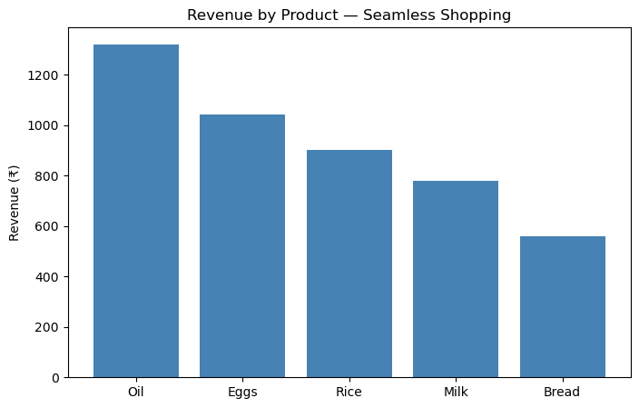
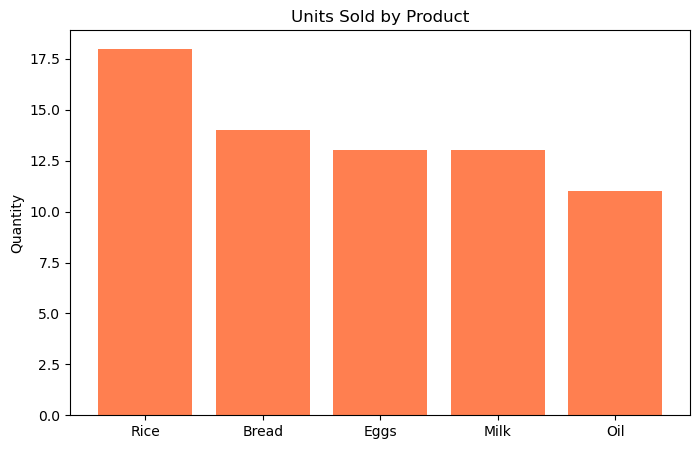
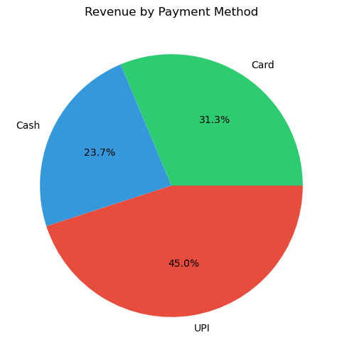
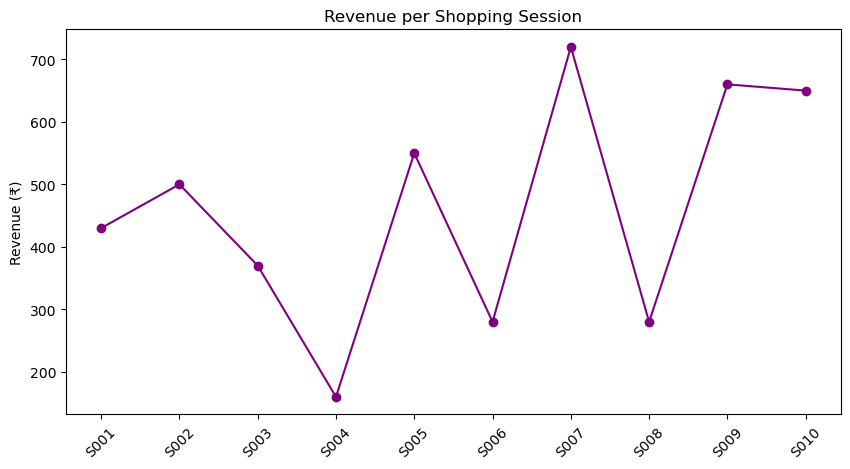

# Seamless Shopping Smart Trolley System
### IoT + RFID + Mobile App + Data Analytics

---

## About
Seamless Shopping is a complete retail automation system that integrates 
RFID hardware, an embedded ESP32 microcontroller, Firebase database, and 
a Flutter mobile application to eliminate manual billing in supermarkets. 
Products are automatically detected as they are added to or removed from 
the smart trolley — the mobile app updates the bill in real time and 
supports digital payment without any checkout queue.

---

## What Makes This Unique
This is not just a software project. It includes:
- Real working hardware — ESP32 + MFRC522 RFID reader on breadboard
- Real RFID tags mapped to actual products
- Live Firebase database sync
- Flutter mobile app with login, cart, payment, and order history
- Full data analytics pipeline on real transaction data

---

## Hardware Built
- Microcontroller: ESP32 DEVKIT V1
- RFID Reader: MFRC522
- Communication: Wi-Fi (Firebase sync)
- Products mapped: Rice, Milk, Bread, Eggs, Oil
- Real RFID scans sent to Firebase in real time

---

## Mobile App Features
- Login and signup
- QR code trolley pairing
- Live cart with real-time billing
- UPI, Card, and Cash payment options
- Order history
- Chef AI Helper for recipe suggestions

---
## Live Demo

https://www.youtube.com/watch?v=yCePffN1dmA

> Click the image above to watch the live demo — real RFID card scanning 
> updating cart and bill in real time on SmartKart mobile app.

## Tech Stack

| Layer | Technology |
|---|---|
| Hardware | ESP32, MFRC522 RFID, Arduino IDE |
| Firmware | Embedded C |
| Database | Firebase Realtime Database |
| Mobile App | Flutter, Dart |
| Analytics | Python, Pandas, Matplotlib, Excel |

---

## Data Analytics Layer
As an extension of the hardware and app, a complete analytics pipeline 
was built on real transaction data collected from the RFID system.

### What Was Analyzed
- 10 real shopping sessions
- 34 RFID transaction records
- 5 product categories
- Total revenue: ₹4,600

### Key Findings
1. **Oil** generates highest revenue — ₹1,320 (28.7% of total) despite being 3rd in quantity
2. **Rice** is most frequently purchased — 18 units across all 10 sessions
3. **UPI** dominates payment — 45% of total revenue (₹2,070)
4. **Average cart value** — ₹460 per session

### Visualizations

### Analytics Notebook
http://localhost:8888/notebooks/Seamless_shopping.ipynb

---
### Powerbi-Dashboard

## References
- A. Singh and R. Gupta, "IoT-Based Smart Shopping Trolley," IEEE, 2020
- M. Hasan et al., "RFID-Based Smart Retail Systems," IJCA, 2019
- Amazon Inc., "Amazon Go: Just Walk Out Technology," 2020
- Espressif Systems, "ESP32 Technical Reference Manual," 2022
